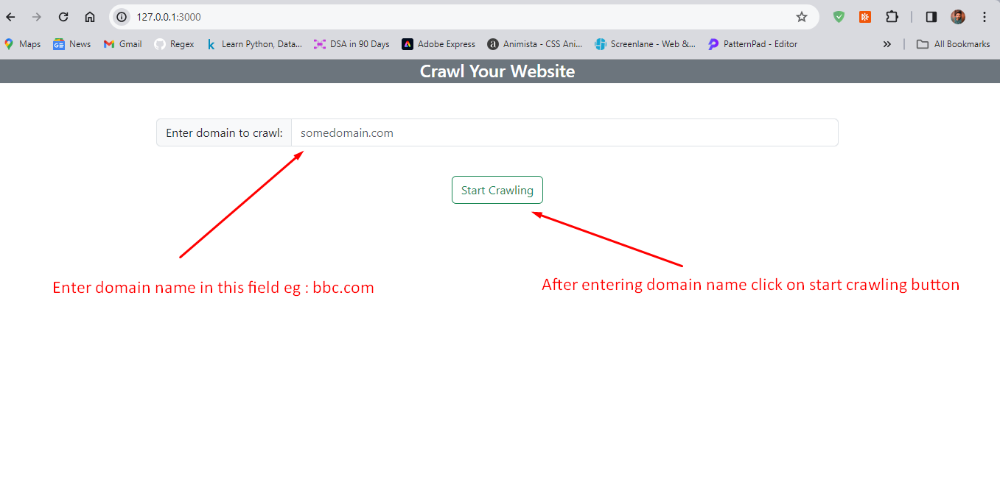
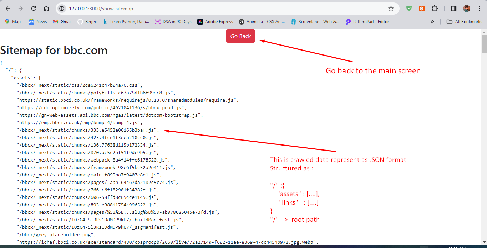

Simple Web Crawler Application build on Ruby on Rails

Ruby - 3.3.0 
Rails 7.1.3.2

Application Insights - >
This application allows user to enter any domain(example.com) or url(https://www.example.com) and after entering domain, user needs to click on start crawling button. Start crawling button will redirect to controller method and call web crawler service which will crawl the website.
** Currently it crawls at root path basically represents as "/" which will provide two keys as 'assets and links' as json. **

Note : Crawled data is in JSON format and it is displayed as JSON structure on view/page as well.

SCREENSHOTS - >

